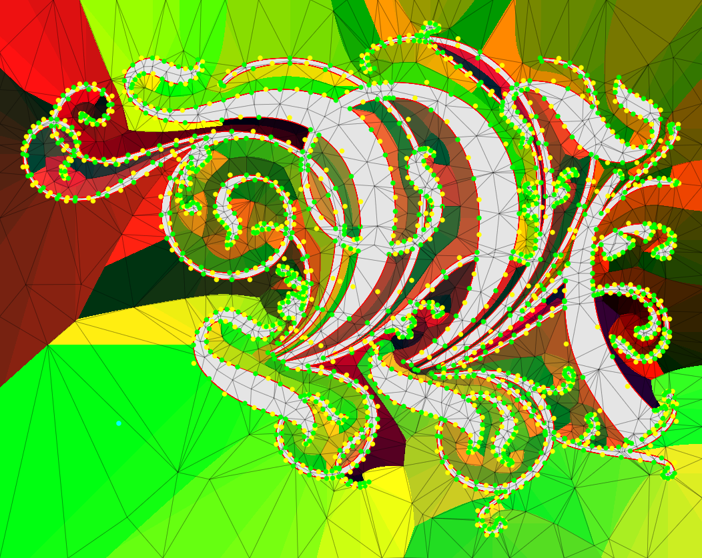
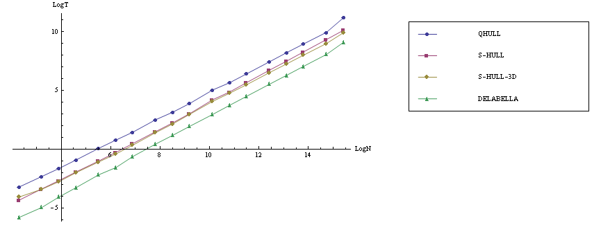

# delabella
## 2D Delaunay triangulation (dela) - super stable (bella!)

- Bunch of credits must go to David for inventing such beautiful algorithm (Newton Apple Wrapper):

  http://www.s-hull.org/

- It is pretty well described in this paper:

  https://arxiv.org/ftp/arxiv/papers/1602/1602.04707.pdf
  
## Example triangulation of signed distance field around some fancy font glyph



## delabella usage:

```c++

#include "delabella.h"
// ...

	// somewhere in your code ...

	int POINTS = 1000000;

	struct MyPoint
	{
		char something;
		float x;
		int something_else;
		float y;
		float foo[5];
	};

	MyPoint* cloud = new MyPoint[POINTS];

	srand(36341);

	// gen some random input
	for (int i = 0; i < POINTS; i++)
	{
		cloud[i].x = rand();
		cloud[i].y = rand();
	}

	IDelaBella* idb = IDelaBella::Create();

	int verts = idb->Triangulate(POINTS, &cloud->x, &cloud->y, sizeof(MyPoint));

	// if positive, all ok 
	if (verts>0)
	{
		int tris = verts / 3;
		const DelaBella_Triangle* dela = idb->GetFirstDelaunayTriangle();
		for (int i = 0; i<tris; i++)
		{
			// do something with dela triangle 
			// ...
			dela = dela->next;
		}
	}
	else
	{
		// no points given or all points are colinear
		// make emergency call ...
	}

	delete[] cloud;
	idb->Destroy();

	// ...


```
## performance comparison:
Output from speedtest.cpp

|         points |        QHULL |       S-HULL |    S-HULL-3D |   DELAUNATOR |    DELABELLA |
| --------------:| ------------:| ------------:| ------------:| ------------:| ------------:|
|             10 |     0.023 ms |     0.009 ms |     0.016 ms |     0.004 ms |     0.002 ms |
|             25 |     0.068 ms |     0.028 ms |     0.033 ms |     0.011 ms |     0.006 ms |
|             50 |     0.132 ms |     0.065 ms |     0.046 ms |     0.022 ms |     0.013 ms |
|            100 |     0.256 ms |     0.124 ms |     0.096 ms |     0.043 ms |     0.028 ms |
|            250 |     0.658 ms |     0.375 ms |     0.267 ms |     0.118 ms |     0.097 ms |
|            500 |     1.354 ms |     0.691 ms |     0.620 ms |     0.301 ms |     0.181 ms |
|          1,000 |     3.173 ms |     1.442 ms |     1.220 ms |     0.527 ms |     0.384 ms |
|          2,500 |     8.709 ms |     3.864 ms |     3.175 ms |     1.509 ms |     1.191 ms |
|          5,000 |    17.050 ms |     8.891 ms |     8.823 ms |     3.231 ms |     2.857 ms |
|         10,000 |    34.756 ms |    18.308 ms |    17.732 ms |     6.947 ms |     5.957 ms |
|         25,000 |   110.397 ms |    53.015 ms |    44.851 ms |    19.349 ms |    16.812 ms |
|         50,000 |   215.183 ms |   114.530 ms |    94.747 ms |    42.580 ms |    35.093 ms |
|        100,000 |   432.254 ms |   231.915 ms |   188.614 ms |    85.278 ms |    74.180 ms |
|        250,000 |  1242.280 ms |   652.245 ms |   510.195 ms |   255.369 ms |   196.017 ms |
|        500,000 |  2782.869 ms |  1400.072 ms |  1090.790 ms |   567.055 ms |   419.753 ms |
|      1,000,000 |  5913.905 ms |  3127.992 ms |  2286.446 ms |  1276.912 ms |   897.941 ms |
|      2,500,000 | 16091.611 ms |  8820.593 ms |  6203.232 ms |  3747.699 ms |  2405.105 ms |
|      5,000,000 | 53809.487 ms | 19320.767 ms | 13289.362 ms |  8374.141 ms |  5056.733 ms |


