# Benchmarked Libraries:

- **DLB** "Delabella" (this library)  
  https://github.com/msokalski/delabella

- **CDT** "CDT"  
  https://github.com/artem-ogre/CDT

- **FAD** "Fade 2D"  
  https://www.geom.at/products/fade2d

- **DEL** "Delaunator"  
  https://github.com/abellgithub/delaunator-cpp

Measured times include:
- Vertices preprocessing if required (removing duplicates, sorting)
- Triangulation
- Postprocessing if required (removing super geometry)

Platform details:
- Windows 10 Pro 21H2
- CPU: AMD Ryzen 9 5950X 16-Core Processor 3.40 GHz
- RAM: Patriot 2.666 GHz 2x16GB
- MSVC Compiler

<table>
  <caption>Uniform</camption>
  <tbody>
    <tr>
      <td>
        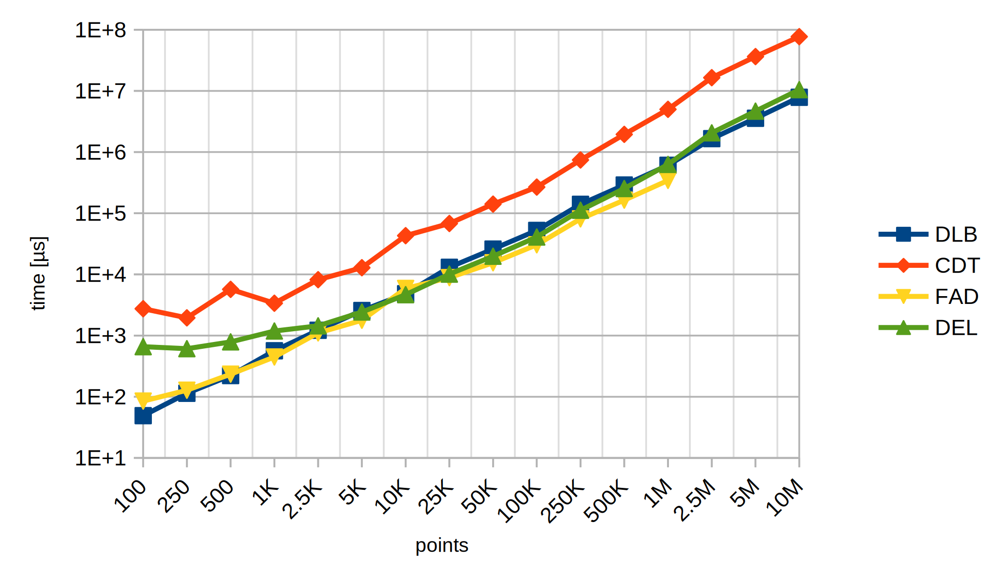
      </td>
      <td>
        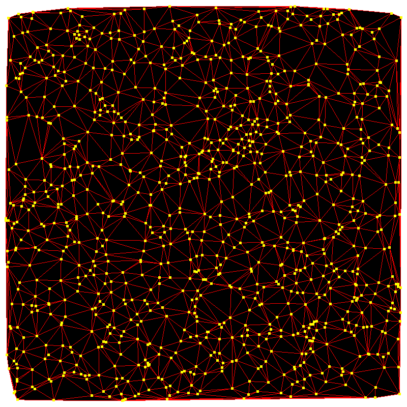
      </td>
    </tr>
    <tr>
      <td colspan="2">
        <pre lang="cpp">
        std::random_device rd{};
        uint64_t seed = rd();
        std::mt19937_64 gen{seed};
        std::uniform_real_distribution&lt;double&gt; uni(-1.0, +1.0);
        for (int i = 0; i &lt; n; i++)
        {
          v[i].x = uni(gen);
          v[i].y = uni(gen);
        }
        </pre>
      </td>
    </tr>
  </tbody>
 </table>
  
<table>
  <caption>Standard</camption>
  <tbody>
    <tr>
      <td>
        
      </td>
      <td>
        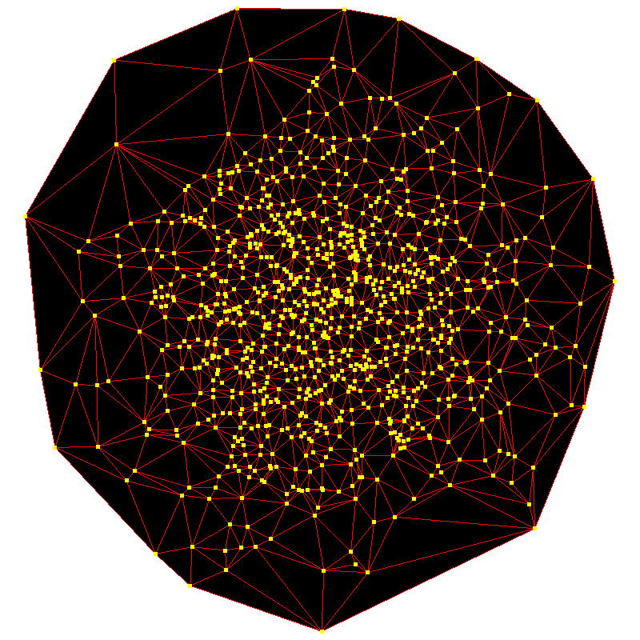
      </td>
    </tr>
    <tr>
      <td colspan="2">
        <pre lang="cpp">
        std::random_device rd{};
        uint64_t seed = rd();
        std::mt19937_64 gen{seed};
        std::normal_distribution&lt;double&gt; std(0.0, 2.0);
        for (int i = 0; i &lt; n; i++)
        {
          v[i].x = std(gen);
          v[i].y = std(gen);
        }
        </pre>
      </td>
    </tr>
  </tbody>
</table>

<table>
  <caption>Gamma</camption>
  <tbody>
    <tr>
      <td>
        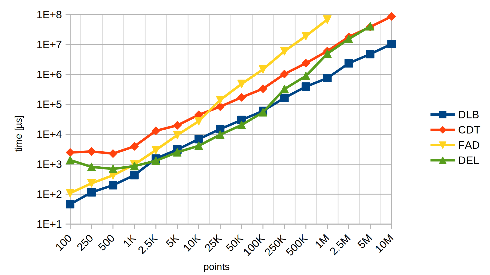
      </td>
      <td>
        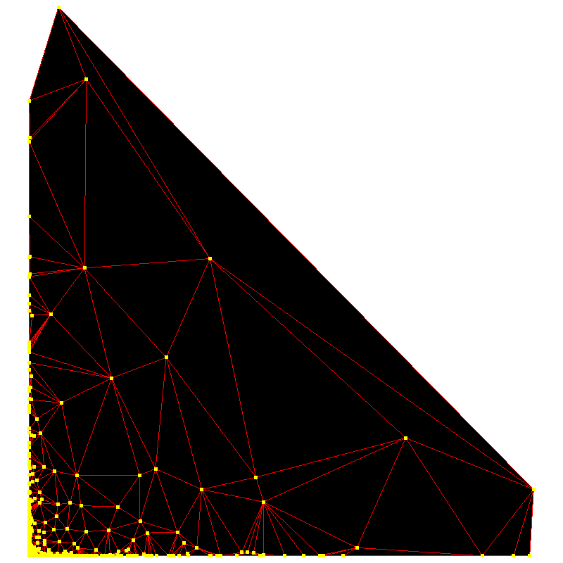
      </td>
    </tr>
    <tr>
      <td colspan="2">
        <pre lang="cpp">
        std::random_device rd{};
        uint64_t seed = rd();
        std::mt19937_64 gen{seed};
        std::gamma_distribution&lt;double&gt; gam(0.1, 2.0);
        for (int i = 0; i &lt; n; i++)
        {
          v[i].x = gam(gen);
          v[i].y = gam(gen);
        }
        </pre>
      </td>
    </tr>
  </tbody>
</table>

<table>
  <caption>Symmetry</camption>
  <tbody>
    <tr>
      <td>
        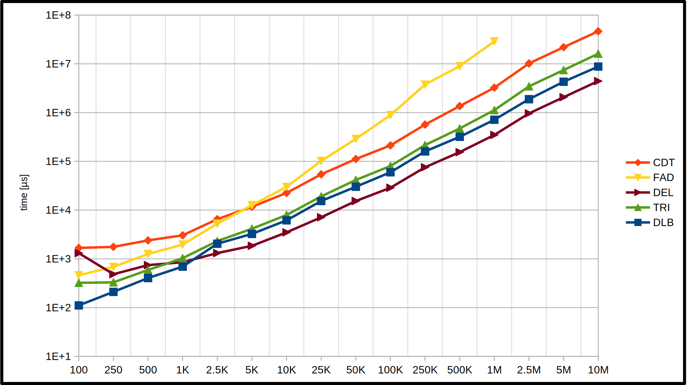
      </td>
      <td>
        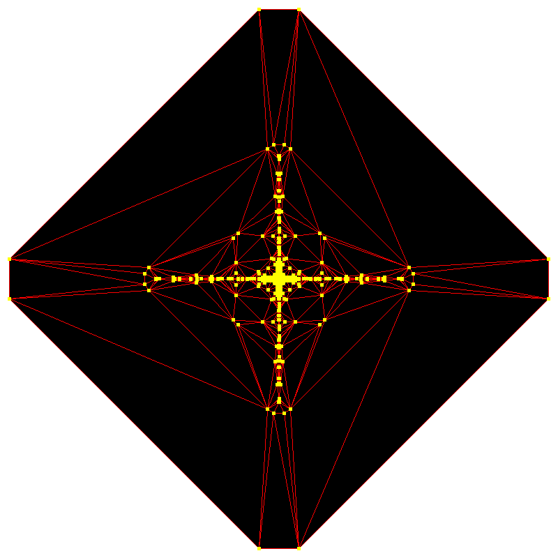
      </td>
    </tr>
    <tr>
      <td colspan="2">
        <pre lang="cpp">
        std::random_device rd{};
        uint64_t seed = rd();
        std::mt19937_64 gen{seed};
        std::gamma_distribution&lt;double&gt; gam(0.1, 2.0);
        for (int i = 0; i &lt; n/8; i++)
        {
          v[8*i+0].x = gam(gen);
          v[8*i+0].y = gam(gen);
          v[8*i+1].x = -v[8*i+0].x;
          v[8*i+1].y = v[8*i+0].y;
          v[8*i+2].x = v[8*i+0].x;
          v[8*i+2].y = -v[8*i+0].y          
          v[8*i+3].x = -v[8*i+0].x;
          v[8*i+3].y = -v[8*i+0].y;
          v[8*i+4].x = v[8*i+0].y;
          v[8*i+4].y = v[8*i+0].x;
          v[8*i+5].x = -v[8*i+0].y;
          v[8*i+5].y = v[8*i+0].x;
          v[8*i+6].x = v[8*i+0].y;
          v[8*i+6].y = -v[8*i+0].x;
          v[8*i+7].x = -v[8*i+0].y;
          v[8*i+7].y = -v[8*i+0].x;
        }
        </pre>
      </td>
    </tr>
  </tbody>
</table>

<table>
  <caption>Circle</camption>
  <tbody>
    <tr>
      <td>
        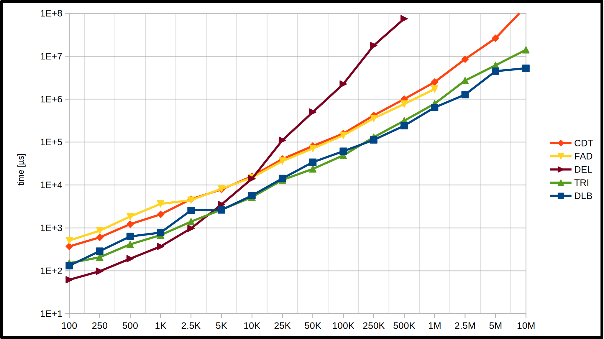
      </td>
      <td>
        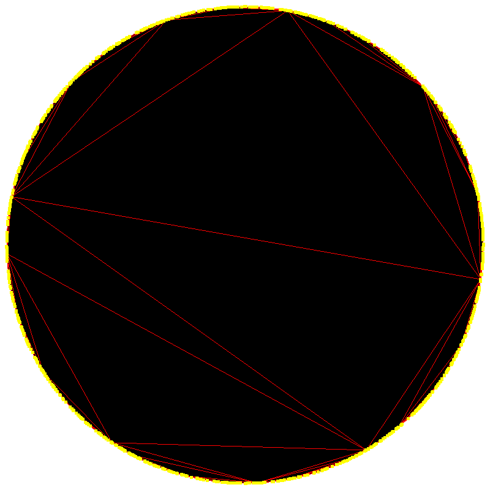
      </td>
    </tr>
    <tr>
      <td colspan="2">
        <pre lang="cpp">
        std::random_device rd{};
        uint64_t seed = rd();
        std::mt19937_64 gen{seed};
        std::normal_distribution&lt;double&gt; std(0.0, 2.0);
        for (int i = 0; i &lt; n; i++)
        {
          double x = std(gen);
          double y = std(gen);
          double l = sqrt(x * x + y * y);
          v[8*i+0].x = x / l;
          v[8*i+0].y = y / l;
        }
        </pre>
      </td>
    </tr>
  </tbody>
 </table>

<table>
  <caption>Barycentric</camption>
  <tbody>
    <tr>
      <td>
        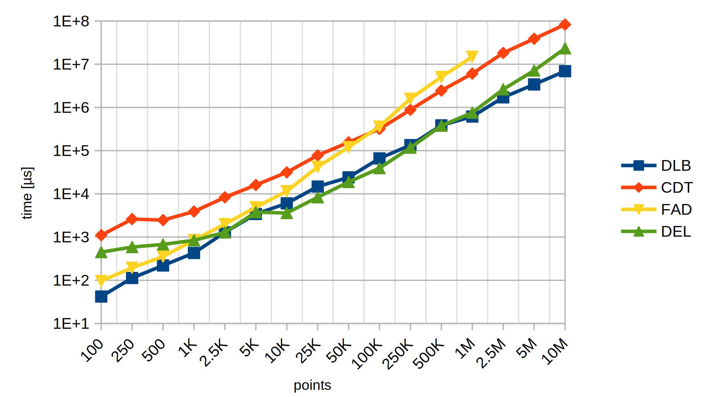
      </td>
      <td>
        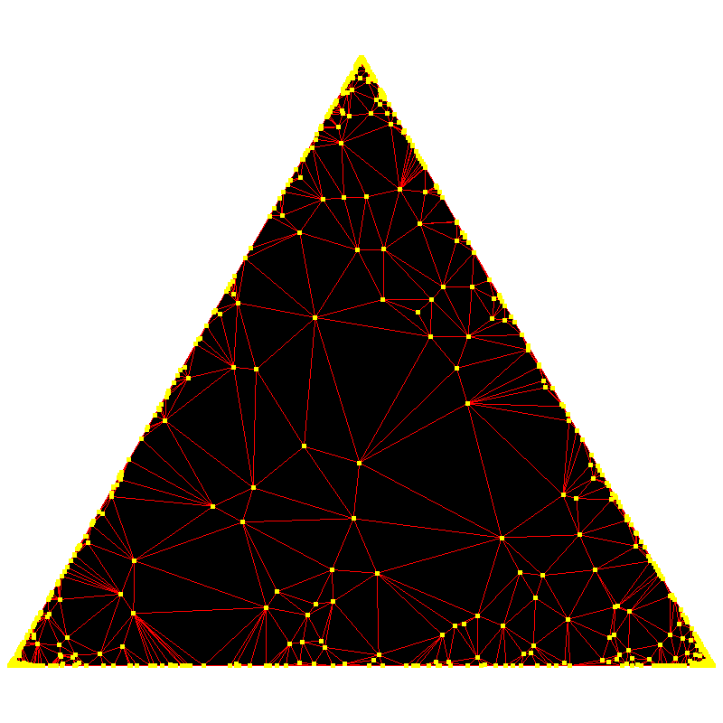
      </td>
    </tr>
    <tr>
      <td colspan="2">
        <pre lang="cpp">
        std::random_device rd{};
        uint64_t seed = rd();
        std::mt19937_64 gen{seed};
        std::gamma_distribution&lt;double&gt; gam(0.1, 2.0);
        const double tri[3][2]=
        {
            {-1.0,0.0},
            {0.0,sqrt(3.0)},
            {+1.0,0.0}
        };
        for (int i = 0; i &lt; n; i++)
        {
          double baryc[3];
          baryc[0] = gam(gen);
          baryc[1] = gam(gen);
          baryc[2] = gam(gen);
          double l = baryc[0] + baryc[1] + baryc[2]; 
          baryc[0] /= l;
          baryc[1] /= l;
          baryc[2] /= l;
          v[i].x =
              tri[0][0] * baryc[0] +
              tri[1][0] * baryc[1] + 
              tri[2][0] * baryc[2];
          v[i].y =
              tri[0][1] * baryc[0] +
              tri[1][1] * baryc[1] + 
              tri[2][1] * baryc[2];
        }
        </pre>
      </td>
    </tr>
  </tbody>
 </table>

<table>
  <caption>Hexagons</camption>
  <tbody>
    <tr>
      <td>
        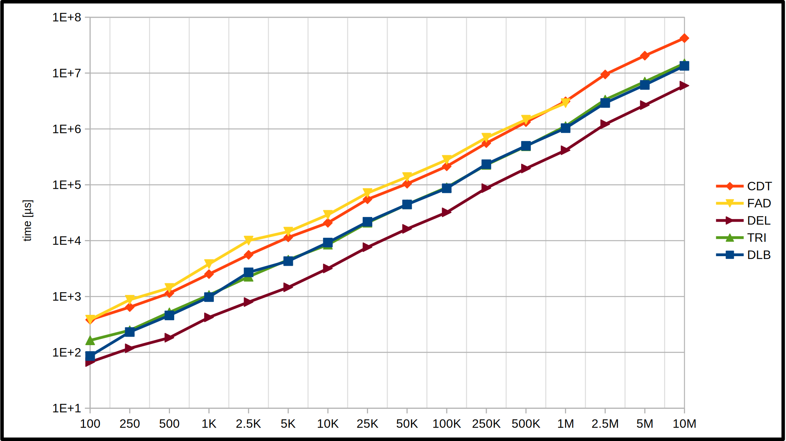
      </td>
      <td>
        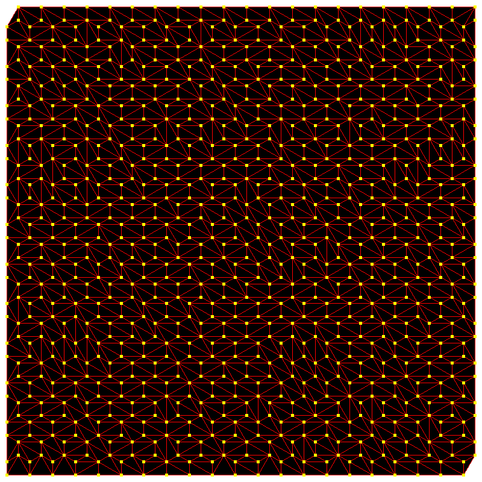
      </td>
    </tr>
    <tr>
      <td colspan="2">
        <pre lang="cpp">
        // please see delabella-sdl2.cpp 
        // for implementation details
        </pre>
      </td>
    </tr>
  </tbody>
 </table>

<!--
| Results | Example preview |
| ------- | --------------- |
|  |  |
|  |  |
|  |  |
|  |  |
|  |  |
|  |  |
|  |  |
-->
